# Mapping the Shadow Economy: Informal Markets in Brazil


## 📌 Project Overview
This repository contains the source code for a research project completed during my Master of Public Policy at the University of Chicago. The project develops a computer vision pipeline to detect and map the spatial distribution of informal markets (*"camelôs"*) in São Paulo, Brazil.

Beyond visual mapping, the project integrates data from the **PNAD-C household survey** to estimate the informal income of these street vendors. By combining object detection with economic microdata, this tool quantifies the "Shadow Economy" at a granular street level, offering new insights for urban planning and economic policy.

## 🛠️ Methodology
The pipeline operates in three stages:
1.  **Data Collection (`sp_real_shape_scan.py`):**
    * Automates the retrieval of geolocated street-level imagery using the Google Maps Static API.
    * Scans coordinates based on official shapefiles of São Paulo's urban grid.
2.  **Object Detection:**
    * Utilizes a custom-trained YOLOv8 model (via Roboflow) to identify street vendors, stalls, and informal commerce markers.
3.  **Economic Analysis & Visualization (`visualize_map.py`):**
    * Constructs a synthetic dataset using **PNAD-C survey data** to map the estimated informal salaries of identified vendors.
    * Generates interactive heatmaps (`sp_hexbin_map.html`) to visualize commercial hotspots against socio-economic wealth indices.

## 📂 Key Files
* `sp_real_shape_scan.py`: Main script for the scanning algorithm.
* `visualize_map.py`: Generates hexbin maps and spatial statistics.
* `build_thesis_dataset.py`: Aggregates raw detection data into a structured dataset for regression analysis.
* `Shadow_Economy_Report.xlsx`: Preliminary findings and data exports.

## 🗂️ Project Structure

```text
Informal-Markets-Brazil/
├── .vscode/                   # VS Code workspace settings
├── Archive_Data/              # Sample detections and backup data
├── Archive_Scripts/           # Deprecated or old scraping scripts
├── Final_Results/             # Output maps, datasets, and figures
├── sp_real_shape_images/      # Raw Google Street View images (Excluded via .gitignore)
├── .env                       # API Keys (Local only, not tracked by Git)
├── .gitignore                 # Specifies which files Git should ignore
├── README.md                  # Project documentation
├── Shadow_Economy_Report.xlsx # Preliminary findings and data exports
├── build_thesis_dataset.py    # Aggregates raw data into structured dataset
├── create_presentation.py     # Script to generate final presentation visuals
├── organize_project.py        # Utility script for file management
├── sp_hexbin_map.html         # Interactive heatmap output
├── sp_real_shape_scan.py      # Main automated scanning script
└── visualize_map.py           # Generates spatial statistics and maps
```

## 🚀 Usage
To run the scanning tool locally:

```bash
# Clone the repository
git clone [https://github.com/CarolBraga9/Informal-Markets-Brazil.git](https://github.com/CarolBraga9/Informal-Markets-Brazil.git)

# Install dependencies
pip install -r requirements.txt

# Run the scanner
python sp_real_shape_scan.py
```

## ⚠️ Data Note
Due to size constraints and licensing, the raw image bank (12,000+ GSV images) and the high-resolution satellite TIFF files (`sp_nighttime_lights.tif`) are **excluded** from this repository via `.gitignore`.
* **Sample Data:** See `Archive_Data/` for sample detections.
* **Full Dataset:** Available upon request for academic verification.

## 🧠 Project Architecture

```mermaid
flowchart LR
    Root[Shadow Economy: Brazil]

    %% Main Branches
    Root --> DC[Data Collection]
    Root --> OD[Object Detection]
    Root --> EA[Economic Analysis]
    Root --> V[Visualization]

    %% Data Collection Leaves
    DC --- DC1[sp_real_shape_scan.py]
    DC --- DC2[Google Maps API]
    DC --- DC3[São Paulo Shapefiles]

    %% Object Detection Leaves
    OD --- OD1[YOLOv8 Model]
    OD --- OD2[Roboflow Platform]
    OD --- OD3[Detect Camelôs]

    %% Economic Analysis Leaves
    EA --- EA1[build_thesis_dataset.py]
    EA --- EA2[PNAD-C Survey]
    EA --- EA3[Wage Estimation]

    %% Visualization Leaves
    V --- V1[visualize_map.py]
    V --- V2[Interactive Heatmaps]
    V --- V3[Socio-economic Data]
```



## 👩‍💻 Author
**Carolina Abdalla Braga**
* MPP Candidate, University of Chicago
* Research Focus: Urban Economics, Development Policy, Data Science
